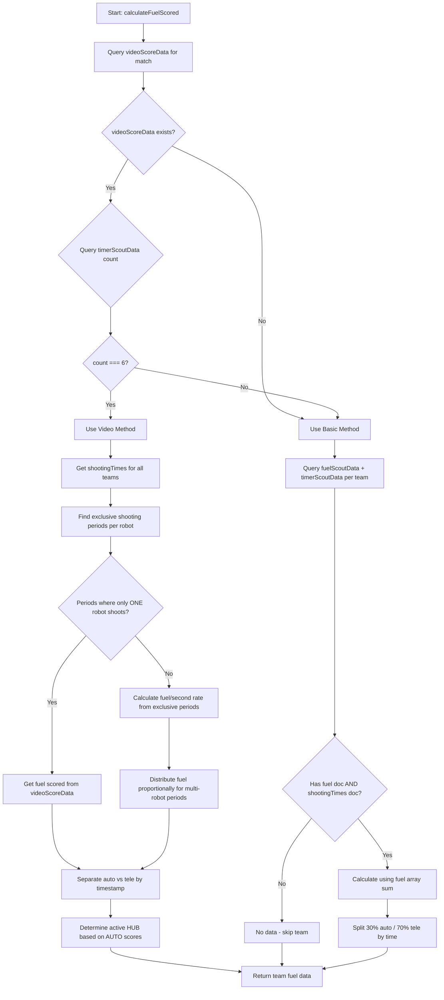

# FuelScored Calculator - Implementation Plan

## Overview

This document outlines the implementation plan for a utility function that calculates `fuelScored` (auto and tele) using Firebase Firestore collections, based on the FRC 2026 Reefscape game rules.

## FRC 2026 Match Timing

| Period | Time Range | Duration |
|--------|------------|----------|
| AUTO | 0:00 - 0:20 | 20 seconds |
| TELEOP - TRANSITION SHIFT | 0:20 - 0:30 | 10 seconds |
| TELEOP - SHIFT 1 | 0:30 - 0:55 | 25 seconds |
| TELEOP - SHIFT 2 | 0:55 - 1:20 | 25 seconds |
| TELEOP - SHIFT 3 | 1:20 - 1:45 | 25 seconds |
| TELEOP - SHIFT 4 | 1:45 - 2:10 | 25 seconds |
| END GAME | 2:10 - 2:30 | 20 seconds |

**Note**: Timer counts DOWN from 2:30 to 0:00

## HUB Active Periods

- **Both HUBs active**: AUTO, TRANSITION SHIFT, END GAME
- **Only ONE HUB active**: During ALLIANCE SHIFTS (SHIFT 1-4)
- **HUB status determination**: Based on AUTO results
  - Alliance with more AUTO fuel → their HUB becomes INACTIVE for SHIFT 1
  - Opponent's HUB becomes ACTIVE for SHIFT 1
  - HUBs alternate each shift

## Data Collections

| Collection | Key Fields | Description |
|------------|------------|-------------|
| `fuelScoutData` | `fuelScored: number[]`, `team`, `match` | Array of burst values (e.g., `[0, 5, 3, 7]`) |
| `timerScoutData` | `shootingTimes: {duration, endShootTime, startShootTime}[]`, `team`, `match`, `alliance` | Array of shooting time objects |
| `videoScoreData` | `redScoreTimeline: {time, score}[]`, `blueScoreTimeline: {time, score}[]`, `match` | Score increments per alliance over time |

## Function Signature

```javascript
/**
 * Calculates fuelScored for all teams in a given match
 * @param {number} matchNumber - The match number to calculate fuel for
 * @returns {Promise<Array<{team: number, match: number, autoFuel: number, teleFuel: number, method: string}>>}
 */
async function calculateFuelScored(matchNumber)
```

## Logic Flow



## Algorithm: Video Method (Priority)

### Preliminary: Determine HUB Status (DO FIRST)
- Compare AUTO fuel scores between alliances (from videoScoreData)
- If AUTO scores are different:
  - Winner alliance → HUB inactive for SHIFT 1, then alternates
  - Loser alliance → HUB active for SHIFT 1
- If AUTO scores are TIE:
  - Look at score increments during ALLIANCE SHIFTS (SHIFT 1-4)
  - If one alliance scores but the other doesn't during a shift (while both were shooting):
    - The scoring alliance's HUB was active
    - The non-scoring alliance's HUB was inactive
- Both HUBS active during: AUTO, TRANSITION SHIFT, END GAME

### Step 1: Get Shooting Times Per Robot
- Query timerScoutData for all teams in the match
- Extract shootingTimes array for each robot
- Each entry has: startShootTime, endShootTime, duration

### Step 2: Crop Shooting Times to Active HUB Periods
- Use HUB active periods determined in Preliminary step
- Fuel scored during inactive HUB periods won't increment the score
- Crop each robot's shooting times to only include active periods for their alliance
- Example: shooting time 1:30 to 1:50, but HUB active 1:20 to 1:45
  - Crop to: 1:30 to 1:45 (only count fuel scored during active period)

### Step 3: Account for Scoreboard Delay
- There is delay between robot scoring and scoreboard incrementing
- Delay formula: `delay = 2 + 0.2 * (time spent shooting)`
  - Example: 10 seconds shooting → 2 + 0.2 * 10 = 4 seconds delay
- When matching score increments to shooting times:
  - Include score increments that occur within (shootingTime + calculated delay)

### Step 4: Find Exclusive Shooting Periods
- For each robot, find time ranges where ONLY that robot was shooting
- Compare each robot's shootingTimes against all other robots on the same alliance

### Step 5: Calculate Fuel Per Second Rate
- For each exclusive period, query videoScoreData for fuel scored during that time
- Calculate: `fuelPerSecond = totalFuelScored / duration`
- If a robot has NO exclusive periods, it has no individual rate

### Step 6: Handle Robots Without Metrics & Distribute Multi-Robot Periods
- If a robot never shot alone (no exclusive periods), it has no fuelPerSecond
- For periods where multiple robots are shooting:
  - First calculate fuel for robots WITH known rates
  - Subtract that from total fuel scored during the period
  - Give the REMAINING fuel to the robot without a metric
  - Example: Robots A & B shooting together, only A has rate
    - Total fuel: 6 balls in 1 second
    - A's rate: 5 balls/sec → A gets 5 balls
    - Remaining: 6 - 5 = 1 ball goes to B
- If all robots have rates: distribute proportionally

### Step 7: Separate Auto vs Tele
- **AUTO**: 0-20 seconds
- **TELEOP**: 20-150 seconds
- Sum fuel for each period separately

## Algorithm: Basic Method (Fallback)

This method is used when we don't have all 6 teams. It requires fuelScoutData AND timerScoutData for each robot.

### Step 1: Calculate Total Fuel
- Sum all values in fuelScored array: `totalFuel = fuelScored.reduce((sum, val) => sum + val, 0)`

### Step 2: Separate Auto vs Tele Using Shooting Times
- For each robot, get shootingTimes from timerScoutData
- Calculate time spent shooting in AUTO (0-20s) vs TELEOP (20-150s)
- Distribute fuel proportionally based on time

Example:
- Robot shoots for 10 seconds in AUTO, 30 seconds in TELEOP
- Total fuel: 20
- AUTO fuel: 20 * (10/40) = 5
- TELEOP fuel: 20 * (30/40) = 15

## Return Data Structure

```javascript
[
  {
    team: 111,
    match: 1,
    autoFuel: 3,
    teleFuel: 7,
    method: "video" // or "basic"
  },
  {
    team: 222,
    match: 1,
    autoFuel: 5,
    teleFuel: 12,
    method: "video"
  }
]
```

## Implementation Steps

1. **Create `src/components/FuelCalculator.js`**
   - Import Firebase firestore functions
   - Define the main `calculateFuelScored` function
   - Export for use in other components

2. **Implement Firestore queries**
   - `getVideoScoreData(matchNumber)` - Query videoScoreData collection
   - `getTimerScoutData(matchNumber)` - Query timerScoutData collection
   - `getFuelScoutData(matchNumber)` - Query fuelScoutData collection

3. **Implement Video Method**
   - Parse shooting times to find exclusive periods
   - Calculate fuel per second rates
   - Distribute proportionally for multi-robot periods
   - Determine active HUB status from AUTO scores
   - Separate auto vs tele by timestamp

4. **Implement Basic Method**
   - Sum fuelScored array for total
   - Calculate time in auto vs tele from shootingTimes
   - Distribute proportionally

## Constants

```javascript
const MATCH_TIMING = {
  AUTO_END: 20,        // seconds from start of match
  TRANSITION_END: 30,  // seconds from start
  SHIFT1_END: 55,
  SHIFT2_END: 80,
  SHIFT3_END: 105,
  SHIFT4_END: 130,
  END_GAME_END: 150,
  TOTAL_DURATION: 150
};

const HUB_STATUS = {
  BOTH_ACTIVE: ['auto', 'transition', 'endgame'],
  ALTERNATING: ['shift1', 'shift2', 'shift3', 'shift4']
};
```

## Assumptions

- Timer counts down from 150 seconds (2:30)
- videoScoreData time is in same format as timerScoutData
- fuelScored array includes a leading 0 (initial state) that should be excluded
- FRC 2026 Reefscape game rules apply

## File Location

The function will be created at: `src/components/FuelCalculator.js`
