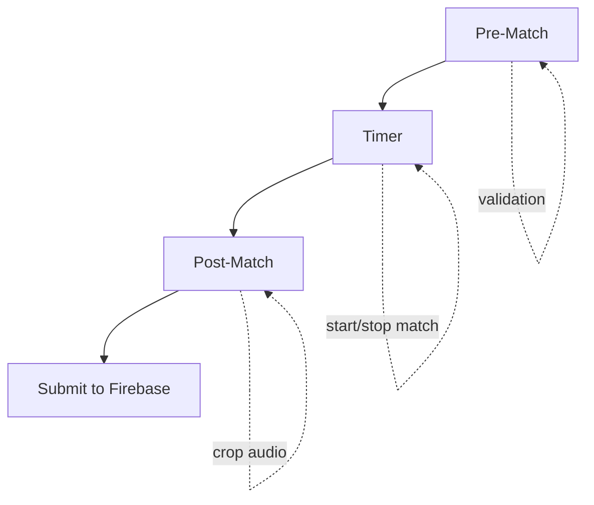
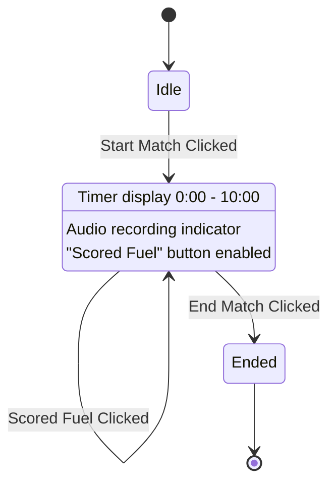

# Human Player Scouting Plan

## Overview

This plan outlines the implementation of a human player scouting feature for the ScoutX FRC scouting application. The feature tracks how much fuel the human player scores and at what times during a match, enabling more accurate fuel metrics calculation for robots by subtracting human player contributions from the scoreboard increments.

## Key Concept

The human player scores fuel for their entire aalliance, not a specific robot. Therefore:
- No team number needed in pre-match (tracks per alliance, not per robot)
- Alliance color (Blue/Red) is the identifier
- Only one person will be doing this scouting
- Data allows analysts to subtract human player fuel from scoreboard totals to get robot-only metrics

## Architecture Overview

The human player scouting system follows the same three-stage flow as Timer Page:

1. **Pre-Match** - Match info, alliance selection, verification code
2. **Timer** - Match timing, scoring events (button clicks)
3. **Post-Match** - Audio cropping only (no quick feedback)

### Page Flow Diagram



## Stage 1: Pre-Match Page

### Inputs Required

| Field | Required | Notes |
|-------|----------|-------|
| Verification Code | Yes | Same verification system as Timer Page |
| Match Number | Yes | Match being scouted |
| Alliance | Yes | Blue or Red |

### Key Differences from Timer Page Pre-Match

- **Removed**: Team Number field (human player is alliance-wide)
- **Removed**: Scouter Name field (only one person doing this)
- **Removed**: Scouter Team field (not needed)
- **Retained**: Alliance selection (Blue/Red)
- **Retained**: Verification code and match number

### Pre-Match Component Structure

```javascript
// HumanPlayerPrematch - Minimal fields

function HumanPlayerPrematch({ data }) {
  // Fields:
  // - verificationCode
  // - match
  // - alliance
  // That's it - no name, team, or scouterTeam
}
```

## Stage 2: Timer Page

### Match Timing Logic

Identical to Timer Page:
- Match duration: 600 seconds (10 minutes max)
- FRC match duration: 163 seconds (2:43)
- Start button begins timer and audio recording
- End button stops match and audio recording
- Audio recording and buzzer detection works the same

### Scoring Event Tracking

**Key Difference**: Instead of hold-to-time shooting ranges, human player uses click-to-record:

- Button says "Scored Fuel" 
- On click, appends current match time to `fuelTimestamps` array
- No duration tracking - just point timestamps
- Simple array of numbers: `[45.3, 132.1, 98.7, ...]`

### Timer UI Components



### Button Behavior

1. **Start Match Button** - Same as Timer Page
2. **Scored Fuel Button** - Click to record a fuel scoring event
   - Records current match time as timestamp
   - Adds value to fuelTimestamps array
   - No duration tracking (point-in-time event)
3. **End Match Button** - Same as Timer Page

### Timer State

```javascript
// State in HumanPlayerTimerContent
const [fuelTimestamps, setFuelTimestamps] = useState([]);

// Add timestamp on button click
const handleScoredFuel = () => {
  if (matchStarted && matchTime > 0 && matchTime < MATCH_DURATION) {
    setFuelTimestamps([...fuelTimestamps, matchTime]);
  }
};
```

### Display

```
Scored Fuel Events (3)
━━━━━━━━━━━━━━━━━━━━━━
● 0:45  [Delete]
● 1:32  [Delete]
● 2:18  [Delete]

Total: 3 scored fuel
```

## Stage 3: Post-Match Page

### Components

1. **Audio Amplitude Graph** - Same as Timer Page
2. **Crop Sliders** - Same as Timer Page (163 second window)
3. **Comments Field** - Same as Timer Page
4. **NO Quick Feedback Section** - Removed per requirements

### Crop Logic

Same as Timer Page - filter and adjust timestamps relative to crop start:

```javascript
// Filter and adjust fuel timestamps
const adjustedTimestamps = fuelTimestamps
  .filter(ts => ts > cropStart)           // Keep events after crop start
  .map(ts => ts - cropStart)              // Relative to crop start (0-163)
  .filter(ts => ts >= 0 && ts <= 163);    // Clamp to valid range
```

## Data Submission

### Firestore Collection

```
Collection: humanPlayerScoutData
Document ID: {matchNumber}_{alliance}
Example: 12_Blue
```

### Document Structure

```javascript
{
  // Identity
  match: number,
  alliance: "Blue" | "Red",
  verificationCode: string,
  
  // Timing data - simple array of timestamps
  fuelTimestamps: number[],  // [45.3, 132.1, 98.7, ...]
  
  // Crop data
  cropStart: number,
  cropEnd: number,
  
  // Metadata
  comments: string,
  timestamp: number,
  totalScoredFuel: number  // fuelTimestamps.length
}
```

## Implementation Steps

### Step 1: Create HumanPlayerScoutData Class

Create a new data class similar to MatchScoutData, handling:
- Simple data storage
- Submission to Firestore

### Step 2: Create Pre-Match Component

- Reuse TimerPrematch structure
- Remove team number, scouterTeam, and name fields
- Keep only: verificationCode, match, alliance
- Add validation

### Step 3: Create Timer Component

- Reuse TimerContent structure
- Replace hold-to-time logic with click-to-record
- Implement fuelTimestamps array state
- Create timestamp display list

### Step 4: Create Post-Match Component

- Reuse TimerPostmatch structure
- Remove quick feedback section
- Keep amplitude graph and cropping

### Step 5: Create Main Page Component

- Wire up stage management
- Implement handleNext/handlePrevious
- Add Firestore submission logic

### Step 6: Add Route

In App.js, add route for human player scouting page

### Step 7: Update FuelCalculator.js

Modify the `calculateFuelScored` function to incorporate human player fuel data into scoreboard filtration.

## FuelCalculator Integration Details

### Changes to calculateFuelScored

The only file that needs to be modified is `FuelCalculator.js`. The human player data will be used in the final step of scoreboard filtration.

### Data Flow

1. Fetch human player data from Firestore collection `humanPlayerScoutData`
2. For each alliance (Red/Blue), get the `fuelTimestamps` array
3. Apply 2.5 second offset to each timestamp (scoreboard delay compensation)
4. After getting filtered increments from `filterFuelIncrements()`, subtract 1 from the closest increment for each human player timestamp

### New Constant

Add a new constant for human player offset:

```javascript
let HUMAN_PLAYER = {
  SCOREBOARD_DELAY_OFFSET: 2.5,  // seconds to account for scoreboard lag
};
```

### New Function: getHumanPlayerData

Add a new Firestore query function:

```javascript
async function getHumanPlayerData(matchNumber, alliance) {
  const qy = query(
    collection(firebase, "humanPlayerScoutData"),
    where("match", "==", String(matchNumber)),
    where("alliance", "==", alliance),
    limit(1)
  );
  const snap = await getDocs(qy);
  if (snap.empty) return [];
  const doc = snap.docs[0].data();
  return doc.fuelTimestamps || [];
}
```

### New Function: adjustForHumanPlayer

Add a new function to handle human player adjustment:

```javascript
/**
 * Adjust scoreboard increments for human player fuel scoring
 * @param {Array} increments - Filtered fuel increments from scoreboard
 * @param {Array} humanPlayerTimestamps - Array of timestamps when human player scored fuel (with 2.5s offset applied)
 * @returns {Array} - Adjusted increments with human player contributions subtracted
 */
function adjustForHumanPlayer(increments, humanPlayerTimestamps) {
  if (!Array.isArray(increments) || increments.length === 0) return increments;
  if (!Array.isArray(humanPlayerTimestamps) || humanPlayerTimestamps.length === 0) return increments;
  
  // Make a copy to avoid mutating original
  const adjusted = increments.map(inc => ({ ...inc }));
  
  for (const hpTime of humanPlayerTimestamps) {
    // Find the closest increment to this human player timestamp
    let closestIndex = -1;
    let closestDistance = Infinity;
    
    for (let i = 0; i < adjusted.length; i++) {
      const distance = Math.abs(adjusted[i].time - hpTime);
      if (distance < closestDistance) {
        closestDistance = distance;
        closestIndex = i;
      } else if (distance === closestDistance) {
        // If equal distance, prefer the earlier one (smaller index)
        if (adjusted[i].time < adjusted[closestIndex].time) {
          closestIndex = i;
        }
      }
    }
    
    // Subtract 1 from the closest increment
    if (closestIndex !== -1 && adjusted[closestIndex].increment > 0) {
      adjusted[closestIndex].increment -= 1;
      adjusted[closestIndex].score -= 1; // Also adjust the cumulative score
    }
  }
  
  return adjusted;
}
```

### Where to Apply in runVideoMethodForAlliance

In the `runVideoMethodForAlliance` function (around line 727-728), after `filterFuelIncrements(scoreTimeline)`:

```javascript
// Get human player timestamps for this alliance
const humanPlayerTimestamps = await getHumanPlayerData(matchNumber, alliance);

// Apply 2.5 second offset to each timestamp
const offsetTimestamps = humanPlayerTimestamps.map(ts => ts + HUMAN_PLAYER.SCOREBOARD_DELAY_OFFSET);

// Get filtered increments
const increments = filterFuelIncrements(scoreTimeline);

// Adjust increments for human player (final step of scoreboard filtration)
const adjustedIncrements = adjustForHumanPlayer(increments, offsetTimestamps);

const segFuel = attributeIncrementsToSegments(adjustedIncrements, resolved);
```

### Also Update getActualFuelFromTimeline

The `getActualFuelFromTimeline` function (line 872-884) is used to calculate `actualRedFuel` and `actualBlueFuel` for accuracy comparison. This should also be adjusted to subtract human player fuel so the comparison is fair (robot fuel vs robot-only fuel, not robot fuel vs total fuel).

```javascript
function getActualFuelFromTimeline(scoreTimeline, humanPlayerTimestamps = []) {
  const rawIncrements = filterFuelIncrements(scoreTimeline);
  
  // Apply 2.5s offset to human player timestamps
  const offsetTimestamps = humanPlayerTimestamps.map(ts => ts + HUMAN_PLAYER.SCOREBOARD_DELAY_OFFSET);
  
  // Adjust increments for human player
  const adjustedIncrements = adjustForHumanPlayer(rawIncrements, offsetTimestamps);
  
  let autoFuel = 0;
  let teleFuel = 0;
  for (const i of adjustedIncrements) {
    if (i.time <= MATCH_TIMING.TRANSITION_SHIFT_END) {
      autoFuel += i.increment;
    } else {
      teleFuel += i.increment;
    }
  }
  return { autoFuel, teleFuel, totalFuel: autoFuel + teleFuel };
}
```

And update the calls in `calculateFuelScored`:

```javascript
// Get human player data for each alliance
const redHumanPlayerTimestamps = await getHumanPlayerData(m, "red");
const blueHumanPlayerTimestamps = await getHumanPlayerData(m, "blue");

if (videoScore) {
  actualRedFuel = getActualFuelFromTimeline(
    videoScore.redScoreTimeline || [],
    redHumanPlayerTimestamps
  );
  actualBlueFuel = getActualFuelFromTimeline(
    videoScore.blueScoreTimeline || [],
    blueHumanPlayerTimestamps
  );
}
```

### Why Both Adjustments Matter

The accuracy calculation compares calculated robot fuel against actual fuel:

```javascript
const redAccuracy = actualRedFuel.totalFuel > 0 
  ? calculatedRedFuel / actualRedFuel.totalFuel 
  : 0;
```

If we only adjust the calculated robot fuel but NOT the actual fuel:
- Robot fuel would be artificially lower (correct)
- But actual fuel would still include human player (incorrect)
- The ratio would be wrong

By adjusting BOTH:
- Robot fuel is lower (subtracted from scoreboard increments)
- Actual fuel is also lower (subtracted total human player count)
- The accuracy ratio is fair - comparing robot-only to robot-only

### Summary of Changes to FuelCalculator.js

| Location | Change |
|----------|--------|
| Constants section | Add `HUMAN_PLAYER` constant with `SCOREBOARD_DELAY_OFFSET: 2.5` |
| Firestore queries | Add `getHumanPlayerData(matchNumber, alliance)` function |
| Attribution utilities | Add `adjustForHumanPlayer(increments, humanPlayerTimestamps)` function |
| getActualFuelFromTimeline | Update to accept humanPlayerTimestamps and apply adjustment |
| calculateFuelScored | Fetch human player data for each alliance and pass to getActualFuelFromTimeline |
| runVideoMethodForAlliance | Fetch human player data, apply offset, and call adjustment function |

## Data Analysis Use Case

### Calculating Robot-Only Fuel

The human player data enables accurate robot fuel calculation:

```
Scoreboard Fuel (from match video) 
  - Human Player Fuel (from this scouting)
  = Robot Fuel Scored

Robot Fuel / Robot Shooting Time = Fuel Efficiency
```

This allows teams to understand:
- How much fuel robots actually scored vs. human player
- Robot shooting efficiency (fuel per second)
- Alliance-level scoring breakdown

### How Human Player Data Integrates with FuelCalculator

The human player scouting data is used in the final step of scoreboard filtration within the `calculateFuelScored` function. This allows more accurate attribution of fuel to robots by accounting for fuel scored by the human player.

#### The Problem

The scoreboard shows total fuel scored by the alliance, including both robot-scored and human player-scored fuel. Without human player data, the algorithm attributes all scoreboard increments to robots, which overestimates robot fuel.

#### The Solution

1. **2.5 Second Offset**: Each human player timestamp gets 2.5 seconds added to account for scoreboard delay/lag
2. **Find Closest Increment**: For each offset human player timestamp, find the closest scoreboard increment
3. **Subtract 1**: Decrease that increment by 1 to account for human player contribution
4. **Tie-Breaking**: If two increments are equidistant, prefer the earlier one (smaller timestamp)

#### Example

```
Human player timestamps: [34.2, 89.5, 120.0]
With 2.5s offset:         [36.7, 92.0, 122.5]

Scoreboard increments (after filtering):
- time: 32.2, increment: 5
- time: 36.7, increment: 3  ← closest to 36.7, subtract 1 → becomes 2
- time: 45.0, increment: 4
- time: 92.0, increment: 2  ← closest to 92.0, subtract 1 → becomes 1
- time: 122.5, increment: 3 ← closest to 122.5, subtract 1 → becomes 2
```

This adjustment happens AFTER `filterFuelIncrements()` and BEFORE `attributeIncrementsToSegments()`, making it the final step in scoreboard processing.

## Comparison with Timer Page

| Feature | Timer Page | Human Player Page |
|---------|------------|-------------------|
| Team Number | Required | Not needed |
| Scouter Team | Required | Not needed |
| Scouter Name | Required | Not needed |
| Alliance | Required | Required |
| Verification Code | Required | Required |
| Match Number | Required | Required |
| Start Match | Button | Button |
| Scoring Tracking | Hold button | Click button |
| Data Type | Time ranges | Simple timestamps array |
| Audio Recording | Yes | Yes |
| Cropping | Yes | Yes |
| Quick Feedback | Yes | No |
| Firestore Collection | timerScoutData | humanPlayerScoutData |

## File Structure

```
src/components/pages/
├── HumanPlayerScout.js       # Main page component
├── HumanPlayerPrematch.js    # Pre-match component
├── HumanPlayerTimer.js       # Timer component  
├── HumanPlayerPostmatch.js   # Post-match component
```

## Constants

```javascript
// Same as Timer Page
const MATCH_DURATION = 600;        // 10 minutes max
const FRC_MATCH_DURATION = 163;     // 2:43 match
const AUDIO_SAMPLE_RATE = 10;       // Samples per second

// New for Human Player
const FIRESTORE_COLLECTION = "humanPlayerScoutData";

// New for FuelCalculator integration
const HUMAN_PLAYER = {
  SCOREBOARD_DELAY_OFFSET: 2.5,  // seconds
};
```

## Success Criteria

- [ ] Pre-match has: verification code, match number, alliance only
- [ ] No team number, scouter name, or scouter team fields
- [ ] Timer page records fuel timestamps as simple array
- [ ] Button click adds timestamp, no hold logic
- [ ] Post-match has cropping but no quick feedback
- [ ] Data submits to humanPlayerScoutData collection
- [ ] Audio recording and buzzer detection works
- [ ] FuelCalculator.js updated with human player adjustment logic