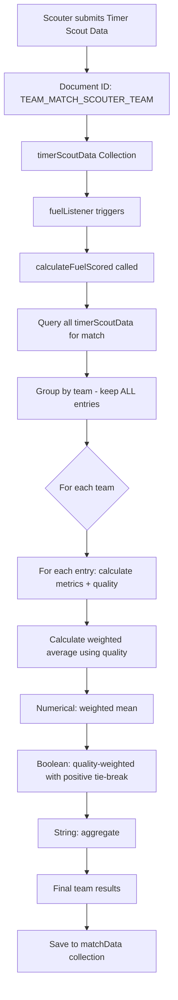

# Multi-Team Scouting Plan: Weighted Averaging with Data Quality

## Overview

This plan outlines the implementation of multi-team scouting per match, where multiple teams can scout the same match. The system will calculate results with highest accuracy by using weighted averages based on data quality metrics.

## Current State Analysis

### Document ID Format
- **Current**: `TEAM_MATCH` (e.g., "254_12")
- **Problem**: When multiple scouters from different teams scout the same team/match, submissions overwrite each other

### Key Files to Modify
1. `src/components/pages/TimerPage.js` - Add scouter team input, update document ID format
2. `src/components/FuelCalculator.js` - Implement multi-entry handling and weighted averaging
3. `src/components/pages/Assignments/AssignmentHelpers.js` - Update document ID references
4. `src/components/UpdateMatchData.js` - May need updates for new document ID format

---

## Implementation Plan

### Phase 1: Data Collection Changes

#### 1.1 Add Scouter Team Input to TimerPage Prematch

**File**: `src/components/pages/TimerPage.js`

**Changes**:
- Add new TextField for "Scouter's Team Number" in the Prematch component (around line 93-100)
- Store this value in the data object with key `scouterTeam` or similar
- Validate input (must be a number, optional field)

**UI Location**: Add after the "Scouter Name" field or "Team Number" field

```javascript
// Example implementation pattern
<Grid2 xs={12} sm={6}>
  <TextField
    label="Scouter's Team Number"
    type="number"
    variant="outlined"
    value={data.get(MatchStage.PRE_MATCH, "scouterTeam")}
    onChange={(e) => {
      data.set(MatchStage.PRE_MATCH, "scouterTeam", e.target.value);
      update();
    }}
    fullWidth
    sx={inputStyle}
  />
</Grid2>
```

#### 1.2 Update Document ID Format

**File**: `src/components/pages/TimerPage.js` (around line 1762)

**Current Code**:
```javascript
doc(firebase, "timerScoutData", team + "_" + matchNum)
```

**New Code**:
```javascript
doc(firebase, "timerScoutData", team + "_" + matchNum + "_" + scouterTeam)
```

**Example**:
- Team 972 scouted team 3256 for match 3
- Document ID: `3256_3_972`

**Data Structure Update**: Add `scouterTeam` field to the document data object

#### 1.3 Important: Use match/team Fields for Querying, NOT Document ID

**Key Change**: While the document ID format is changing, the code that queries timerScoutData should use the `match` and `team` fields in the document data, NOT parse the document ID. This provides flexibility for future changes.

**Why**: The document ID is for uniqueness (preventing overwrites), but querying should be based on the actual data fields.

**Files to verify**:
- FuelCalculator.js - Already queries by `match` field (line 498-500)
- AssignmentHelpers.js - Uses document ID for checking (may need update)

---

### Phase 2: FuelCalculator Modifications

**NOTE**: Weighted averaging will NOT be done here - it moves to UpdateMatchData.js

#### 2.1 Add scouterTeam Parameter to calculateFuelScored

**File**: `src/components/FuelCalculator.js`

**Function Signature Change**:

```javascript
// Current signature:
export async function calculateFuelScored(matchNumber)

// New signature:
export async function calculateFuelScored(matchNumber, scouterTeam)
```

**Parameters** (both REQUIRED):
- `matchNumber`: The match number to calculate data for
- `scouterTeam`: The scouter's team number (REQUIRED). Used to find the unique timerScoutData entry by matching:
  - `match` field = matchNumber
  - `team` field = the team being scouted (still determined from the timerScoutData)
  - `scouterTeam` field = scouterTeam parameter

**Purpose**:
- With multiple scouters possible, there could be multiple timerScoutData entries for the same team/match
- The function MUST know which specific scouter's observation to calculate
- This enables calculating metrics for a specific scouter's observation

**Implementation**:
1. Update function signature - scouterTeam becomes required parameter
2. In getTimerScoutData or subsequent filtering, filter to entries where `scouterTeam` matches the parameter
3. Return the result for that specific scouter's observation

**No Other Changes**:
- The internal calculation logic remains the same
- The quality metric calculation remains the same

---

### Phase 3: UpdateMatchData Modifications (Averaging Logic)

**File**: `src/components/UpdateMatchData.js`

**Why here**: FuelCalculator calculates a single team's match data; UpdateMatchData aggregates multiple scouter observations for the same team/match.

#### 2.5.1 Add getQualityWeight Function

Add this function (matching TeamMatches.js pattern):

```javascript
// Get weight based on data quality color range
const getQualityWeight = (quality) => {
  if (!quality || quality < 0.5) return 0.25;  // Red: 25%
  if (quality < 0.75) return 0.50;             // Yellow: 50%
  return 1.0;                                   // Green: 100%
};
```

#### 2.5.2 Add Weighted Averaging Function

**New Function**: `aggregateScouterData(results)`

This function receives the array of {metrics, quality} objects from FuelCalculator for each team and calculates weighted averages:

```javascript
function aggregateScouterData(resultsByTeam) {
  // resultsByTeam is Map<teamNumber, Array<{metrics, quality}>>
  
  const aggregated = [];
  
  for (const [teamNumber, entries] of resultsByTeam) {
    if (entries.length === 1) {
      // Only one scouter - no need to average
      aggregated.push({
        teamNumber,
        ...entries[0].metrics,
        scouterCount: 1
      });
      continue;
    }
    
    // Multiple scouters - calculate weighted averages
    let totalWeight = 0;
    const weightedSums = {};
    const trueWeights = {};  // For boolean metrics
    const falseWeights = {}; // For boolean metrics
    
    // Initialize accumulators based on first entry's metrics
    const metricKeys = Object.keys(entries[0].metrics);
    for (const key of metricKeys) {
      if (typeof entries[0].metrics[key] === 'number') {
        weightedSums[key] = 0;
      } else if (typeof entries[0].metrics[key] === 'boolean') {
        trueWeights[key] = 0;
        falseWeights[key] = 0;
      }
    }
    
    // Accumulate weighted values
    for (const entry of entries) {
      const weight = getQualityWeight(entry.quality);
      totalWeight += weight;
      
      for (const key of metricKeys) {
        if (typeof entry.metrics[key] === 'number') {
          weightedSums[key] += entry.metrics[key] * weight;
        } else if (typeof entry.metrics[key] === 'boolean') {
          if (entry.metrics[key]) {
            trueWeights[key] += weight;
          } else {
            falseWeights[key] += weight;
          }
        }
      }
    }
    
    // Calculate final aggregated metrics
    const aggregatedMetrics = {};
    for (const key of metricKeys) {
      if (typeof entries[0].metrics[key] === 'number') {
        aggregatedMetrics[key] = totalWeight > 0 
          ? weightedSums[key] / totalWeight 
          : 0;
      } else if (typeof entries[0].metrics[key] === 'boolean') {
        // If tied, assume positive (to not underestimate)
        aggregatedMetrics[key] = trueWeights[key] >= falseWeights[key];
      } else {
        // String or other types - keep first value or aggregate
        aggregatedMetrics[key] = entries[0].metrics[key];
      }
    }
    
    aggregated.push({
      teamNumber,
      ...aggregatedMetrics,
      scouterCount: entries.length,
      totalWeight
    });
  }
  
  return aggregated;
}
```

#### 2.5.3 Update updateMatchData Function

**File**: `src/components/UpdateMatchData.js` (around line 37)

**Changes**:
- After getting results from calculateFuelScored
- If any team has multiple entries with quality data
- Call aggregateScouterData to compute weighted averages
- Use aggregated results for matchData document

---

### Phase 3: Assignment Helpers Updates

#### 3.1 Update Document ID References

**File**: `src/components/pages/Assignments/AssignmentHelpers.js`

**Locations**:
- Line 574: `const docId = ${assignment.team}_${assignment.match};`
- Line 603: `const docId = ${teamNumber}_${matchNumber};`

**Changes**:
- These functions need to be updated to handle the new document ID format
- However, since these functions are checking if a specific scouter submitted data, they may need to:
  - Either know the scouter's team number
  - Or query with a pattern/collection group

**Alternative Approach**:
- Add a new function to check submissions that accounts for multiple scouters
- Or modify existing check to accept scouterTeam parameter

---

### Phase 4: UpdateMatchData Considerations

#### 4.1 Document ID Handling

**File**: `src/components/UpdateMatchData.js`

**Current Behavior**:
- Listens to timerScoutData collection for changes
- Triggers recalculation when new docs added

**No Changes Needed**:
- The listener already triggers on any new document
- New document IDs will automatically trigger recalculation
- The calculateFuelScored function will handle the new format

---

## Data Flow Diagram



---

## Implementation Steps Summary

| Step | Description | Files |
|------|-------------|-------|
| 1 | Add "Scouter's Team Number" input field to TimerPage Prematch | TimerPage.js |
| 2 | Update document ID format to include scouter team | TimerPage.js |
| 3 | Add scouterTeam field to document data | TimerPage.js |
| 4 | Add REQUIRED scouterTeam parameter to calculateFuelScored function | FuelCalculator.js |
| 5 | Modify FuelCalculator to filter by (match, team, scouterTeam) when scouterTeam provided | FuelCalculator.js |
| 6 | Add getQualityWeight and aggregateScouterData functions to UpdateMatchData | UpdateMatchData.js |
| 7 | Update updateMatchData to loop through all teams and call calculateFuelScored for each scouter entry | UpdateMatchData.js |
| 8 | Update document ID references in AssignmentHelpers | AssignmentHelpers.js |

---

## Next Steps After This Plan

Once this plan is approved, we can proceed to:

1. Detailed implementation of each phase
2. Testing strategy for multi-team scenarios
3. Data migration considerations for existing data
4. UI/UX refinements based on implementation learnings

---

## Weighting Approach (Quality Bands)

**Quality Weight Function** (matching TeamMatches.js pattern):

```javascript
const getQualityWeight = (quality) => {
  if (!quality || quality < 0.5) return 0.25;  // Red: 25%
  if (quality < 0.75) return 0.50;             // Yellow: 50%
  return 1.0;                                   // Green: 100%
};
```

**Rationale**:
- Uses ALL data from all scouters
- Green quality (high confidence) counts as full weight (100%)
- Yellow quality (medium confidence) counts as half weight (50%)
- Red quality (low confidence) counts as quarter weight (25%)
- This weighted sum approach is more robust than just taking the highest quality entry

---

## Questions for Further Detail

The user mentioned they will go into more detail on:
- **How the averages will be calculated** with multiple data entries per team's match
- Specific weighting formulas
- Boolean metric handling specifics
- String aggregation preferences

This plan provides the framework; the detailed calculation logic will be refined in subsequent implementation phases.