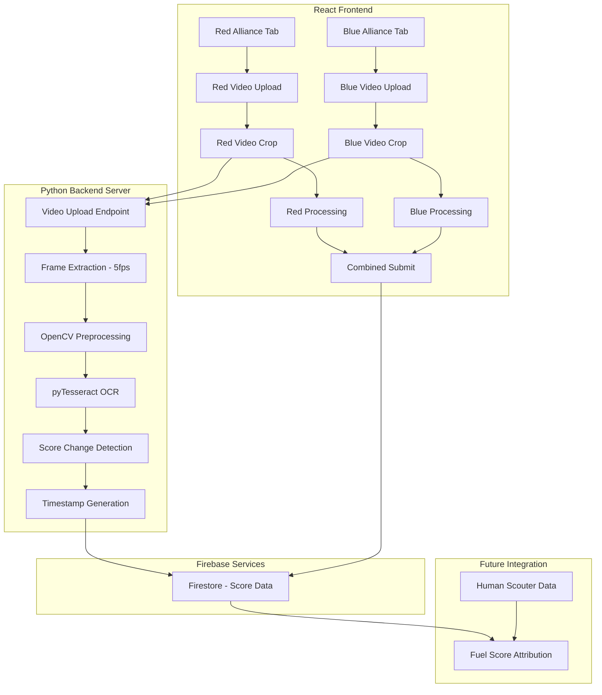
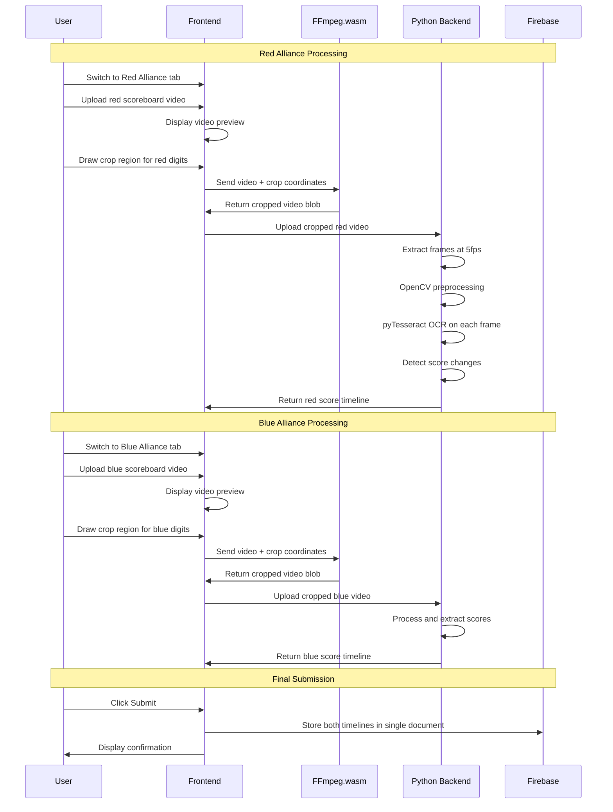
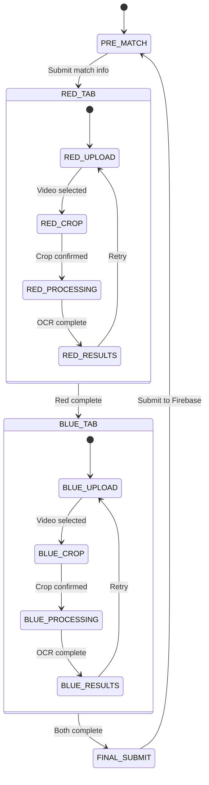
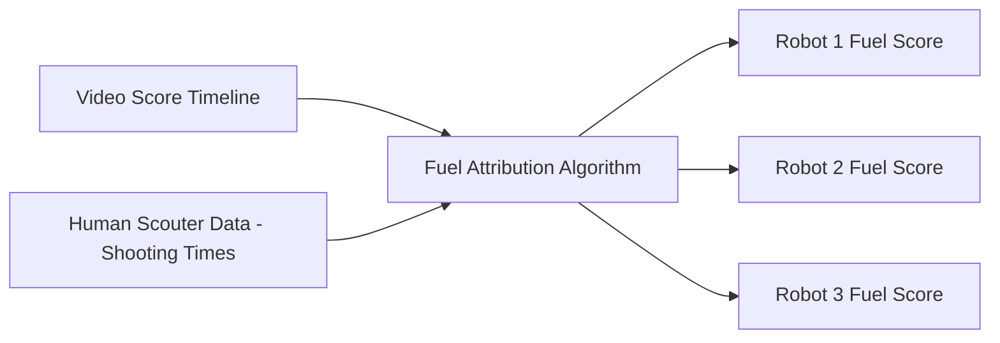

# Video Processing Pipeline Architecture Plan


## Overview


This document outlines the architecture for a video processing pipeline that extracts real-time score data from FRC match videos using OCR. The pipeline enables synchronization with human scouter data to approximate individual robot fuel scoring contributions.


## System Architecture





## Data Flow





---


## Component Details


### 1. Frontend - Video Upload and Cropping


#### Files to Create/Modify:
- [`src/components/pages/VideoScout.js`](src/components/pages/VideoScout.js) - Add tabbed interface for Red/Blue alliance
- [`src/components/pages/videoscout/VSAllianceTab.js`](src/components/pages/videoscout/VSAllianceTab.js) - Reusable alliance processing component
- [`src/components/pages/videoscout/VSVideoCrop.js`](src/components/pages/videoscout/VSVideoCrop.js) - New cropping component
- [`src/components/pages/videoscout/VSProcessing.js`](src/components/pages/videoscout/VSProcessing.js) - Processing status component
- [`src/components/pages/videoscout/VSResults.js`](src/components/pages/videoscout/VSResults.js) - Results display component
- [`src/utils/videoCropper.js`](src/utils/videoCropper.js) - FFmpeg.wasm integration
- [`src/components/VideoScoutData.js`](src/components/VideoScoutData.js) - Update to handle both alliance timelines


#### Video Cropping UI Features:
- Interactive crop region selection with drag handles
- Aspect ratio lock for consistent digit regions
- Preview of cropped region in real-time
- Support for both Red and Blue alliance videos
- Ability to adjust crop after initial selection


#### FFmpeg.wasm Integration:
```javascript
// Example implementation structure
import { createFFmpeg, fetchFile } from '@ffmpeg/ffmpeg';


const ffmpeg = createFFmpeg({ log: true });


async function cropVideo(videoFile, cropRegion) {
 if (!ffmpeg.isLoaded()) {
   await ffmpeg.load();
 }
  ffmpeg.FS('writeFile', 'input.mp4', await fetchFile(videoFile));
  await ffmpeg.run(
   '-i', 'input.mp4',
   '-filter:v', `crop=${cropRegion.width}:${cropRegion.height}:${cropRegion.x}:${cropRegion.y}`,
   '-c:a', 'copy',
   'output.mp4'
 );
  const data = ffmpeg.FS('readFile', 'output.mp4');
 return new Blob([data.buffer], { type: 'video/mp4' });
}
```


---


### 2. Python Backend - OCR Processing


#### New Directory Structure:
```
video-processor/
├── app.py                 # Flask/FastAPI main application
├── requirements.txt       # Python dependencies
├── Dockerfile            # Container configuration
├── config.py             # Configuration settings
├── processors/
│   ├── __init__.py
│   ├── frame_extractor.py    # OpenCV frame extraction
│   ├── image_preprocessor.py # OpenCV image enhancement
│   ├── ocr_processor.py      # pyTesseract OCR
│   └── score_analyzer.py     # Score change detection
├── utils/
│   ├── __init__.py
│   ├── firebase_client.py    # Firebase Admin SDK
│   └── video_downloader.py   # Video download utilities
└── tests/
   ├── __init__.py
   ├── test_ocr.py
   └── test_processors.py
```


#### API Endpoints:


| Endpoint | Method | Description |
|----------|--------|-------------|
| `/api/process-video` | POST | Upload and process cropped video |
| `/api/process-video/{job_id}` | GET | Get processing status |
| `/api/results/{job_id}` | GET | Get OCR results |


#### Frame Extraction - 5fps:
```python
import cv2


def extract_frames(video_path, fps=5):
   cap = cv2.VideoCapture(video_path)
   video_fps = cap.get(cv2.CAP_PROP_FPS)
   frame_interval = int(video_fps / fps)
  
   frames = []
   frame_count = 0
  
   while cap.isOpened():
       ret, frame = cap.read()
       if not ret:
           break
          
       if frame_count % frame_interval == 0:
           timestamp = frame_count / video_fps
           frames.append((timestamp, frame))
      
       frame_count += 1
  
   cap.release()
   return frames
```


#### OpenCV Preprocessing Pipeline:
```python
import cv2
import numpy as np


def preprocess_for_ocr(image):
   # Convert to grayscale
   gray = cv2.cvtColor(image, cv2.COLOR_BGR2GRAY)
  
   # Apply thresholding for better digit contrast
   _, thresh = cv2.threshold(gray, 0, 255, cv2.THRESH_BINARY + cv2.THRESH_OTSU)
  
   # Noise removal
   kernel = np.ones((1, 1), np.uint8)
   processed = cv2.morphologyEx(thresh, cv2.MORPH_OPEN, kernel)
  
   # Optional: Scale up for better OCR accuracy
   scale_factor = 2
   processed = cv2.resize(processed, None, fx=scale_factor, fy=scale_factor)
  
   return processed
```


#### pyTesseract OCR Configuration:
```python
import pytesseract


def extract_score(image):
   # Configure for digit recognition only
   custom_config = r'--oem 3 --psm 7 -c tessedit_char_whitelist=0123456789'
  
   score_text = pytesseract.image_to_string(image, config=custom_config)
  
   # Clean and validate result
   score = ''.join(filter(str.isdigit, score_text))
  
   return int(score) if score else None
```


#### Score Change Detection:
```python
def detect_score_changes(frame_data):
   # frame_data: list of (timestamp, score) tuples
   score_changes = []
   previous_score = None
  
   for timestamp, score in frame_data:
       if score is not None and score != previous_score:
           if previous_score is not None:
               increment = score - previous_score
               score_changes.append({
                   'timestamp': round(timestamp, 2),
                   'previous_score': previous_score,
                   'new_score': score,
                   'increment': increment
               })
           previous_score = score
  
   return score_changes
```


---


### 3. Firebase Data Structure


#### Firestore Collection: `videoScoreData`


```javascript
// Document ID: {matchNumber}
{
 matchNumber: "42",
 processedAt: 1708646400000,  // timestamp
  // Red Alliance Score Timeline
 redScoreTimeline: [
   {
     timestamp: 0.00,      // seconds from video start
     score: 0,
     increment: 0
   },
   {
     timestamp: 5.20,
     score: 2,
     increment: 2
   },
   {
     timestamp: 12.40,
     score: 5,
     increment: 3
   },
   // ... more score changes
 ],
  // Blue Alliance Score Timeline
 blueScoreTimeline: [
   {
     timestamp: 0.00,
     score: 0,
     increment: 0
   },
   {
     timestamp: 3.80,
     score: 4,
     increment: 4
   },
   // ... more score changes
 ],
  // Summary Statistics
 redTotalScore: 45,
 blueTotalScore: 38,
  // Metadata
 scouterName: "John Doe",
 notes: "Good video quality, minor OCR errors around 2:30"
}
```


**Note:** Video URLs are not stored - only the processed score timeline data is saved to Firestore.


---


### 4. VideoScout Pipeline Stages


Updated stage flow for [`VideoScout.js`](src/components/pages/VideoScout.js) with tabbed interface:





#### UI Layout with Tabs:


```
┌─────────────────────────────────────────────────────────┐
│  Video Scout - Match 42                                  │
├─────────────────────────────────────────────────────────┤
│  [Red Alliance]  [Blue Alliance]                         │
├─────────────────────────────────────────────────────────┤
│                                                          │
│  ┌─────────────────────────────────────────────────┐    │
│  │                                                  │    │
│  │         Video Upload / Crop / Results           │    │
│  │              (Current Tab Content)              │    │
│  │                                                  │    │
│  └─────────────────────────────────────────────────┘    │
│                                                          │
│  Status:                                                 │
│  ✓ Red: Processed (45 total score)                      │
│  ○ Blue: Not started                                     │
│                                                          │
│                    [Submit to Firebase]                  │
└─────────────────────────────────────────────────────────┘
```


#### Stage Components:


| Stage | Component | Description |
|-------|-----------|-------------|
| PRE_MATCH | [`VSPrematch.js`](src/components/pages/videoscout/VSPrematch.js) | Match info entry |
| RED_TAB | `VSAllianceTab.js` | Red alliance processing container |
| BLUE_TAB | `VSAllianceTab.js` | Blue alliance processing container |
| UPLOAD | `VSVideoUpload.js` | Video file selection |
| CROP | `VSVideoCrop.js` | Interactive crop region selection |
| PROCESSING | `VSProcessing.js` | Upload progress and OCR status |
| RESULTS | `VSResults.js` | Score timeline display and confirmation |


---


## Implementation Plan


### Phase 1: Frontend Tabbed Interface
1. Create `VSAllianceTab.js` component for reusable alliance processing
2. Update `VideoScout.js` with Red/Blue tab navigation
3. Add status tracking for both alliances
4. Implement combined submit button


### Phase 2: Frontend Video Cropping
1. Install FFmpeg.wasm package
2. Create video cropping UI component with interactive selection
3. Implement FFmpeg.wasm video cropping functionality
4. Add preview and validation for cropped video


### Phase 3: Python Backend Setup
1. Create Python project structure
2. Implement frame extraction at 5fps
3. Add OpenCV image preprocessing
4. Integrate pyTesseract OCR
5. Implement score change detection algorithm
6. Create REST API endpoints


### Phase 4: Firebase Integration
1. Update Firestore security rules for new collection
2. Update `VideoScoutData.js` to handle both alliance timelines
3. Implement combined submission with `redScoreTimeline` and `blueScoreTimeline`
4. Add backend-to-Firebase data sync


### Phase 5: Pipeline Integration
1. Connect frontend to Python backend API
2. Add processing status polling
3. Implement results display component
4. Add error handling and retry logic


### Phase 6: Testing and Optimization
1. Test OCR accuracy with sample scoreboard videos
2. Optimize preprocessing for different scoreboard types
3. Add validation for OCR results
4. Performance testing and optimization


---


## Technical Considerations


### OCR Accuracy Challenges:
- **Digit segmentation**: Scoreboard digits may be LED/LCD style
- **Glare/reflection**: Arena lighting can cause issues
- **Motion blur**: Fast score changes may blur
- **Partial occlusion**: Scoreboard elements may overlap digits


### Solutions:
- Train custom Tesseract model on FRC scoreboard fonts
- Use multiple preprocessing techniques and compare results
- Implement confidence scoring for OCR results
- Add manual correction UI for low-confidence readings


### Performance Considerations:
- FFmpeg.wasm is ~25MB, load asynchronously
- Consider Web Workers for video processing
- Cache FFmpeg.wasm in browser storage
- Implement progressive loading for long videos


---


## Dependencies


### Frontend:
```json
{
 "@ffmpeg/ffmpeg": "^0.12.0",
 "@ffmpeg/util": "^0.12.0"
}
```


### Python Backend:
```
flask>=2.3.0
opencv-python>=4.8.0
pytesseract>=0.3.10
firebase-admin>=6.2.0
gunicorn>=21.0.0
python-dotenv>=1.0.0
```


---


## Future Integration: Fuel Score Attribution


The score timeline data will be used to attribute fuel scores to individual robots:





This integration will be implemented in a future phase after the video processing pipeline is complete.